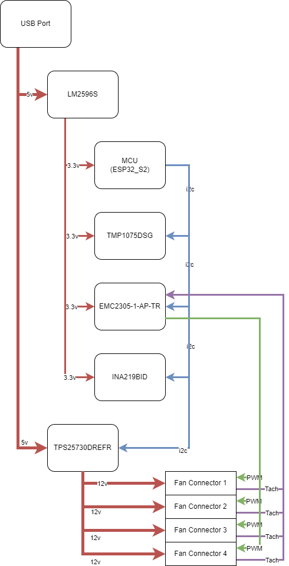

# Fan Dominator
-------------

This project describes how to build a smart fan controller designed to power 4 x 140mm 12v fans (PC Case fans).

It uses USB-C input for both powering the fans and programming the ESP32 micro-controller.

The device will monitor temperature via the TMP1075DSG sensor. It will also monitor fan speed (RPM) via the EMC2305 and monitor power usage via the INA219BIDR.

The ESP32 will be wifi enabled allowing an API for external commands and consumption of monitoring data.

### Design
See block diagram for more details:

### Bill of materials

### Compiling
